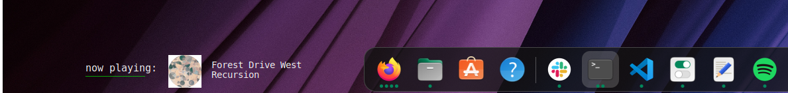

<h1 align="center">Now Spotyfing</h1>

**Now Spotyfing** is a Conky widget which shows a Now Playing when music is played via Spotify.

<div align="center" style="display:inline">

</div>

### Table of contents

- [Requirements](#requirements)
  - [Packages](#packages)
- [Installation](#installation)
- [Credits](#credits)

## Requirements

### Packages

- [conky](https://github.com/brndnmtthws/conky/)
- [ffmpeg](https://www.ffmpeg.org/)
- [playerctl](https://github.com/altdesktop/playerctl)

> Ubuntu: `sudo apt install conky ffmpeg playerctl`

> Arch: `sudo pacman -S conky ffmpeg playerctl`

### Fonts

> It uses `Monospace` which should be included in Ubuntu and probably also other distros.

### Supported Players

- [Spotify](https://www.spotify.com/)
- [spotifyd](https://github.com/Spotifyd/spotifyd)

## Installation

1. Install all required [packages](#packages):
```bash
# Ubuntu
$ sudo apt install conky ffmpeg playerctl
# Arch
$ sudo pacman -S conky ffmpeg playerctl
```
2. Clone the repo:
```bash
$ git clone git@github.com:mik0w/now-spotifying.git
```
3. Run the `start.sh` script to start the widget (forks to background):
```bash
$ path/to/now-clocking/start.sh
```

## FAQ

> **Why are there 3 Conky widgets?**

To make aligning everything easier.

## Credits

Huge props to the original creators, [@gamehelp16](https://github.com/gamehelp16) and [@Rayzr522](https://github.com/Rayzr522). I forked this script and I want to add "Like" button to it (but probably it can't be done with conky).

